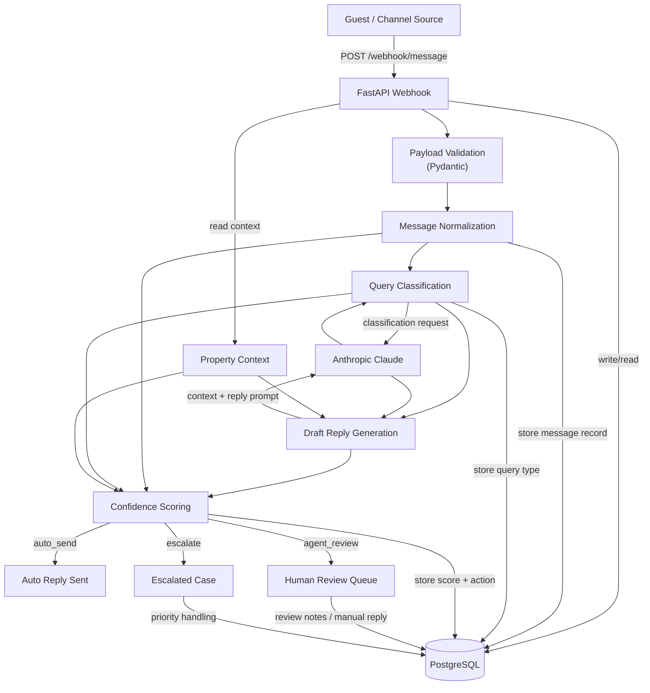

# Message Handler API

AI-powered FastAPI webhook service for handling guest messages, classifying user intent, generating replies and deciding whether responses should be auto-sent, reviewed by a human agent or escalated.

---

# Features

- FastAPI webhook endpoint
- Message normalization pipeline
- AI-powered query classification
- Claude-generated draft replies
- Rule-based confidence scoring system
- Intelligent response routing
- PostgreSQL database schema
- Modular service-based architecture

---

# Architecture Diagram



# Project Structure

```bash
Message_Handler_Api/
│
├── app/
│   ├── main.py
│   ├── models.py
│   ├── property_context.py
│   ├── requirements.txt
│   │
│   └── services/
│       ├── classifier.py
│       ├── claude_handler.py
│       ├── confidence.py
│       └── normalizer.py
│
├── schema.sql
├── .env.example
└── README.md
```

---

# Setup Instructions

## 1. Clone the Repository

```bash
git clone https://github.com/ayzonit/Message_Handler_Api.git
cd Message_Handler_Api
```

---

## 2. Create a Virtual Environment

### Windows

```bash
python -m venv venv
venv\Scripts\activate
```

### Linux / macOS

```bash
python3 -m venv venv
source venv/bin/activate
```

---

## 3. Install Dependencies

```bash
pip install -r app/requirements.txt
```

---

## 4. Configure Environment Variables

Create a `.env` file in the project root.

```env
ANTHROPIC_API_KEY=your_api_key_here
```

---

## 5. Setup PostgreSQL Database

Run the schema file:

```bash
psql -U postgres -d your_database -f schema.sql
```

This creates tables for:

- guests
- reservations
- conversations
- messages
- AI decision tracking

---

## 6. Run the Application

```bash
uvicorn app.main:app --reload
```

Server runs at:

```bash
http://127.0.0.1:8000
```

---

# API Endpoint

## POST `/webhook/message`

Handles incoming guest messages and returns:

- query classification
- AI-generated reply
- confidence score
- recommended action

---

# Example Request

```json
{
  "source": "whatsapp",
  "guest_name": "Rahul",
  "message": "Can I check in early tomorrow?",
  "timestamp": "2026-05-13T10:30:00Z",
  "booking_ref": "BR1024",
  "property_id": "villa_1"
}
```

---

# Example Response

```json
{
  "message_id": "c3d91ab2",
  "query_type": "post_sales_checkin",
  "drafted_reply": "Hi Rahul, early check-in depends on room availability. We’ll confirm it shortly.",
  "confidence_score": 0.84,
  "action": "agent_review"
}
```

---

# Message Processing Pipeline

```text
Incoming Guest Message
          │
          ▼
Message Normalization
          │
          ▼
Query Classification
          │
          ▼
AI Draft Reply Generation
          │
          ▼
Confidence Scoring
          │
          ▼
Decision Routing
```

---

# Supported Query Types

| Query Type | Description |
|---|---|
| `pre_sales_availability` | Availability-related inquiries |
| `pre_sales_pricing` | Pricing and cost questions |
| `post_sales_checkin` | Check-in/check-out and arrival queries |
| `special_request` | Custom guest requests |
| `complaint` | Complaints and issue handling |
| `general_enquiry` | General property information |

---

# Confidence Scoring Logic

The confidence scoring module estimates how safe it is to send an AI-generated reply without human intervention. It uses a rule-based score between `0.00` and `1.00`, then maps that score to an action.

---

## How the Score is Calculated

The system starts with a base confidence score of:

```text
0.55
```

The score is then adjusted using multiple heuristics.

---

## 1. Complaint Handling

If the detected query type is:

```text
complaint
```

the system immediately returns:

| Score | Action |
|---|---|
| `0.40` | `escalate` |

This ensures complaints are handled by humans instead of being auto-sent.

---

## 2. Empty Reply Detection

If the generated reply is empty:

| Score | Action |
|---|---|
| `0.00` | `escalate` |

---

## 3. Reply Length Evaluation

The reply length affects confidence.

| Condition | Score Impact |
|---|---|
| Less than 12 words | `-0.12` |
| Between 12 and 100 words | `+0.05` |
| More than 100 words | `-0.08` |

This rewards replies that are concise but still informative.

---

## 4. Vague Phrase Detection

The system penalizes uncertain or weak replies containing phrases like:

- `will check`
- `get back to you`
- `not sure`
- `cannot confirm`
- `unable to confirm`
- `please note`

If detected:

```text
-0.15 confidence penalty
```

---

## 5. Query Keyword Matching

Each query type has an expected keyword set.

Example:

```python
"pre_sales_pricing":
{"rate", "price", "pricing", "cost", "inr"}
```

The system checks how many query keywords appear inside the generated reply.

| Keyword Matches | Score Impact |
|---|---|
| 2 or more | `+0.14` |
| 1 keyword | `+0.08` |
| 0 keywords | `-0.08` |

---

## 6. Message-to-Reply Content Overlap

The reply is compared with the original guest message.

| Overlap Condition | Score Impact |
|---|---|
| 3 or more overlapping words | `+0.08` |
| No overlap | `-0.10` |

This rewards replies that remain contextually aligned with the guest’s message.

---

## 7. Query-Specific Confidence Boosts

Additional boosts are applied depending on the query category.

### Pre-Sales Availability

| Condition | Boost |
|---|---|
| Reply contains `available` | `+0.08` |
| Reply contains numbers/dates | `+0.04` |

---

### Pre-Sales Pricing

If reply contains terms like:

- `inr`
- `rate`
- `price`
- `cost`
- `night`

Boost:

```text
+0.10
```

---

### Post-Sales Check-In

If reply contains terms like:

- `checkin`
- `wifi`
- `password`

Boost:

```text
+0.10
```

---

### Special Requests

If reply contains terms like:

- `arrange`
- `request`
- `transfer`
- `chef`
- `pickup`

Boost:

```text
+0.08
```

---

### General Enquiries

If reply contains terms like:

- `allow`
- `parking`
- `pets`
- `yes`

Boost:

```text
+0.06
```

---

# Final Score Normalization

After all adjustments:

- score is clamped between `0.00` and `1.00`
- rounded to 2 decimal places

---

# Action Routing

| Confidence Score | Action |
|---|---|
| `< 0.60` | `escalate` |
| `0.60 - 0.85` | `agent_review` |
| `> 0.85` | `auto_send` |

---

# Example Confidence Flow

Example guest message:

```text
"Is WiFi available in the villa?"
```

Generated reply:

```text
"Yes, WiFi is available in the villa. The password will be shared during check-in."
```

Confidence factors:

| Factor | Impact |
|---|---|
| Proper reply length | `+0.05` |
| Relevant keywords matched | `+0.14` |
| Strong content overlap | `+0.08` |
| Check-in related terms found | `+0.10` |

Final confidence:

```text
0.92 → auto_send
```

---

# Notes

- The AI only responds using provided property context.
- Fabricated information should be avoided.
- Complaint handling is intentionally conservative.
- Confidence scoring is rule-based and deterministic.

---

# Future Improvements

- Multi-language support
- Vector memory integration
- Conversation summarization
- Real-time admin dashboard
- Human-in-the-loop workflows
- Booking platform integrations

---

# Author

Ayush Bhattacharjee
